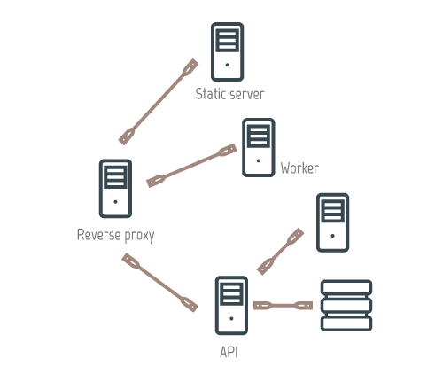

# scribe.js-amqp-aggregator
AMQP + Scribe.js for a lightweight logs management



### The server
It's a NodeJS app that runs Scribe.js with its WebPanel and listen for logs over an AMQP queue.

```
node log_server.js
```

### An example of client
This is a NodeJS app that logs something.

```
node client.js
```
